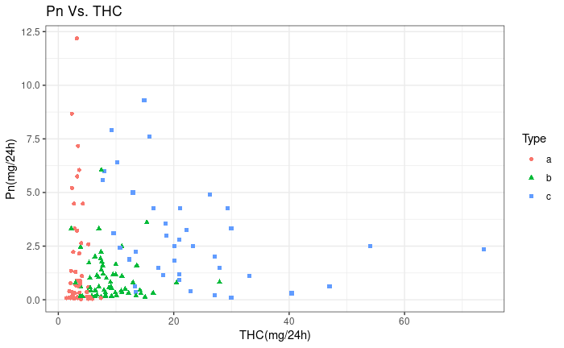
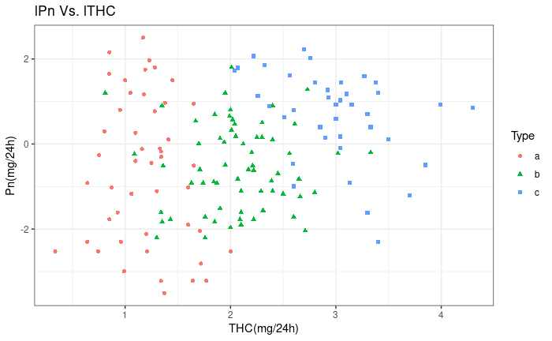
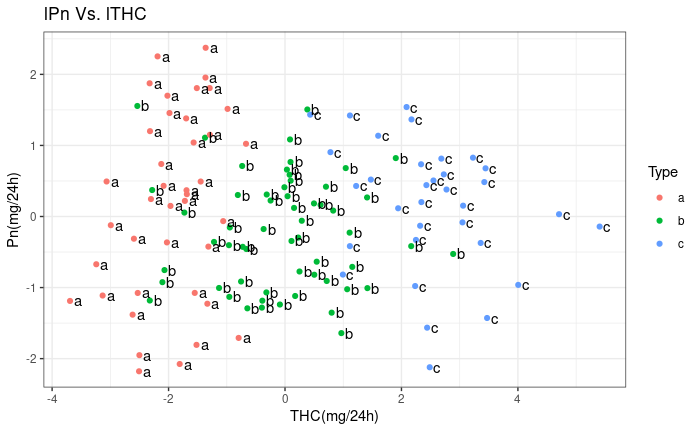
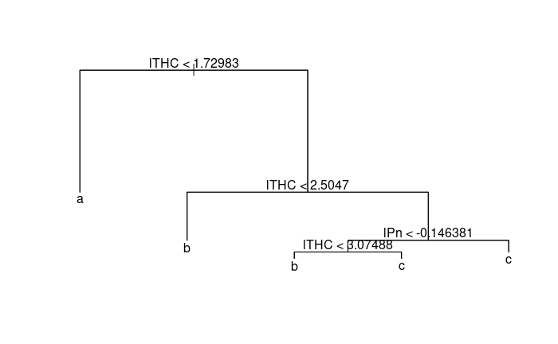
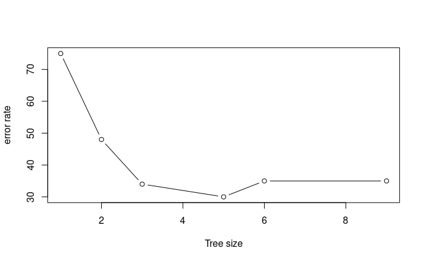
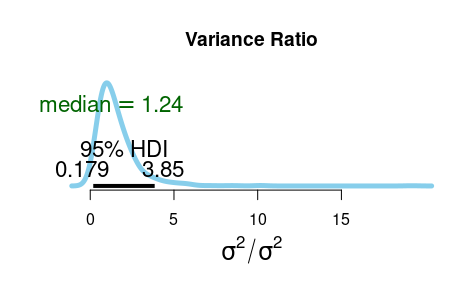
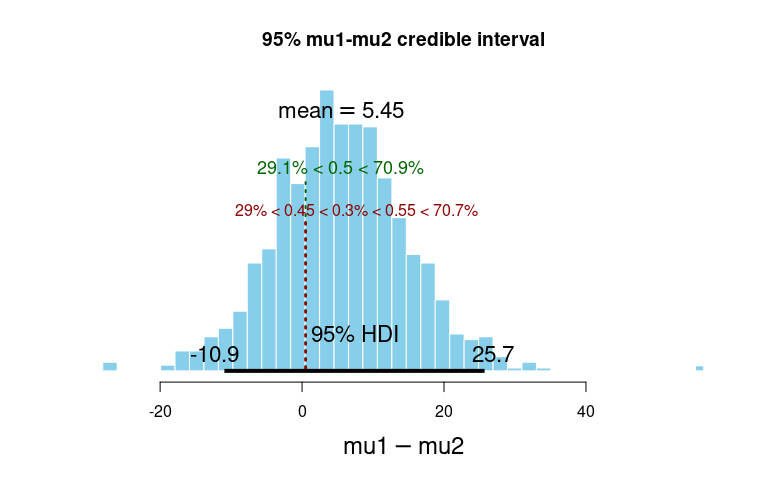
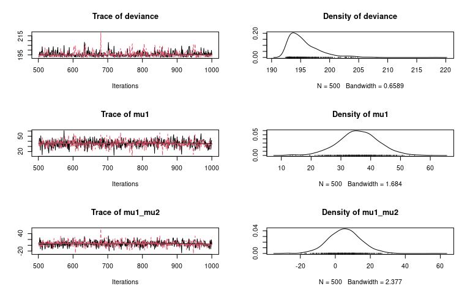

# 🧠 Predictive Modeling of Cushing’s Syndrome

**Goal:** Predict syndrome subtype using urinary biomarkers through interpretable models and Bayesian inference.

**Tags:** LDA, SVM, Decision Tree, Logistic Regression, JAGS, Bayesian Inference  
**Author:** Paul Muriithi  
**Date:** July 2022

---

## 📂 Dataset

- **150 observations** from Cushing’s syndrome patients
- Two key biomarkers: `Pregnanetriol (Pn)` and `Tetrahydrocortisone (THC)`
- Three syndrome types: Adenoma (a), Hyperplasia (b), Carcinoma (c)

| Pn    | THC   | Type |
|-------|-------|------|
| 8.67  | 2.34  | a    |
| 0.04  | 5.16  | a    |
| 1.00  | 8.33  | b    |

### 🔍 Raw and Log-Transformed Plots

Raw data was highly skewed. We applied log transformation to normalize and separate classes better.

  


---

## 🎯 Classification Models

We trained and compared multiple models using log-transformed features (`lPn`, `lTHC`).

### Linear Discriminant Analysis (LDA)

**Training Accuracy:** 83.1%  
**Test Accuracy:** 75%  
**Confusion Matrix (Test):**

| Predicted → | a | b | c |
|-------------|---|---|---|
| **Actual a** | 6 | 1 | 0 |
| **Actual b** | 1 | 6 | 3 |
| **Actual c** | 0 | 0 | 3 |

LDA offered a good balance of accuracy and interpretability.



---

### Classification Tree

Simple and interpretable. Used to visualize rules learned from features.

- **Train Accuracy:** 85.4%  
- **Test Accuracy:** 75%  
- 9 terminal nodes



---

### Support Vector Machine (SVM)

- **Linear SVM** had test accuracy of **80%**
- Polynomial SVM (degree 2) performed best (90%) but at cost of interpretability

Cross-validation confirmed **Polynomial SVM as top performer**



---

## 📉 Logistic Regression (Income & Age vs Overdrawn Status)

Used binary logistic regression on a financial dataset.

### Model Output
log-odds(overdrawn) = 6.23 - 0.004 × Income - 0.073 × Age


- Odds of being overdrawn decrease as income or age increases
- Confidence intervals for coefficients included 0 → borderline significance

---

## 🧮 Bayesian Modeling: US vs Japan P/E Ratios

We compared average P/E ratios using both **frequentist** and **Bayesian** methods.

### Frequentist (Variance Ratio Test)
- F = 1.22, p-value = 0.75  
- No significant difference



### Bayesian Posterior Distributions

Using **JAGS**, we modeled credible intervals under different assumptions.

- **Equal variance model**: credible interval overlaps 0  
- **Unequal variance model**: wider interval, more uncertainty

  


---

## 🧠 Key Learnings

✅ Polynomial SVM yielded highest prediction accuracy (90%)  
✅ LDA and Trees remain interpretable options with solid performance  
✅ Bayesian methods provided robust uncertainty quantification  
✅ Full data science workflow—from preprocessing to statistical inference—was implemented

---

## 🗂 Project Structure

```text
├── data/
│   └── cushings.xlsx
├── plots/
│   ├── lPn_vs_lTHC.png
│   ├── LDA_output_Grouped_Type.png
│   ├── Final_Cassification_tree.png
│   ├── crossvalidation_error.png
│   ├── Variance_Ratio.png
│   ├── posterior_distributions.png
│   └── Posterior_distribution _mu1mu2_95CI.png
├── analysis/
│   └── cushings_model.Rmd
├── README.md

